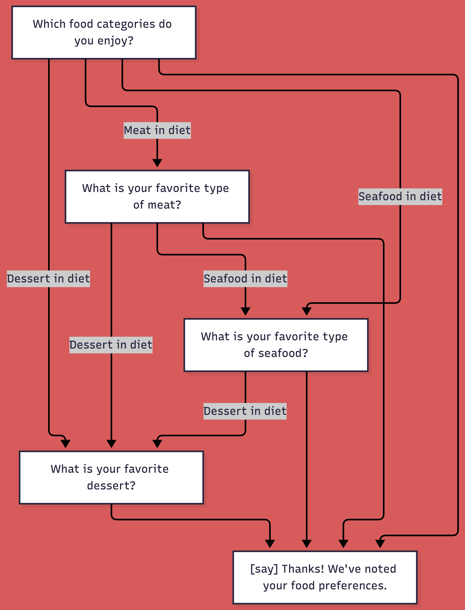
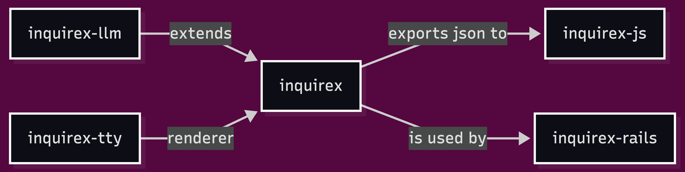

# Inquirex

## Deterministic meets Probabilistic

#### To Power a Smart Form Copilot

*Ask the right questions. Skip the rest.*

<hr />

<small>Konstantin Gredeskoul — April 2026</small>

<small>For SFRuby ❤️</small>

---

## The Problem

— You need to qualify leads, onboard users, or collect structured intake data

— The questions you ask **depend on the answers** to the previous questions

— Some forms are very long and users give up...

---

## Example — Tax Preparer Site: Intake Form

> [!INFO]
>
> Tax preparer might want to understand the level of complexity of your taxes before you even get on the phone. Moreover, you might want to know the price range of their help.

* A simple W-2 filer → **only 8 qualifying questions**

* A complex business filer → **17-27 questions**

*Same form, Radically different paths.*

---

<div style="float: left">

## Example with<br /> Branching

</div>



---

## What Exists Today

| Category | Gems | Gap |
|----------|------|-----|
| **State machines** | AASM, Statesman | Model object lifecycle, not questionnaires |
| **Form wizards** | Wicked, FormWizard | Linear steps — no conditional branching |
| **Workflow engines** | FlowCore | Orchestration, not user-facing Q&A |
| **Rules engines** | Ruleby, Wongi | Pure inference — no flow, no answers |
| **Survey gems** | Surveyor | Basic skip logic, no composable rules |

---

## After Extensive Research, <br />Today Nothing Combines:

> [!IMPORTANT]
> 
> A declarative DSL that defines a questionare as a graph with verbs as nodes, with AST branching and transition rules as edges, with Automatic Accumulators based on the answers, and, speaking of answers — Typed and Validated Answers. And, on top of it — With JSON serialization of both the form definition and the answers. Not to mention: **modern LLM capabilities!**.

---

## The Core Concept

A qualifying questionnaire is a nothing but a **directed graph** where:

<br />

* **Nodes** are steps with verbs: `ask`, `say`, `header`, `btw`, `warning`, `confirm`
* **Edges** are transitions with **AST-based rule conditions**
* **The Engine** walks the graph, collects **typed answers**, tracks history
* **Everything serializes to JSON** — same flow in terminal, browser, or mobile

---

## Now: The Big Idea

#### What if we combine<br> **deterministic DSL** with **probabilistic LLM**?

* Perhaps we can shortcut the long line of questioning by asking the user to describe the topic in their own words?

* The combination of deterministic question flow, typed answers, decoupled rendering for each platform, and (most importantly) LLM's ability to extract structured answers from the free-form text is the primary innovation of this technology.

---

## The Main Insight

<div style="text-align: left">

<br/>

1. DSL defines **what data you need** — (deterministic, typed, validated)

<br/>

2. LLM extracts **what it can** —  (probabilistic, from free text)

<br/>

3. Engine asks **only what's left** — (skip_if + rule evaluation)

</div>
---

## The Gem Ecosystem



---

## Base Gem

### inquirex

[https://github.com/inquirex/inquirex](https://github.com/inquirex/inquirex)

---

<br/>

<br/>

# Inquirex<br />In Action

---

### The Conversational DSL

```ruby
Inquirex.define id: "tax-intake", version: "1.0.0" do
  start :filing_status

  ask :filing_status do
    type :enum
    question "What is your filing status?"
    options single: "Single", married_jointly: "Married Filing Jointly"
    widget target: :desktop, type: :radio_group, columns: 2
    transition to: :dependents
  end

  ask :dependents do
    type :integer
    question "How many dependents?"
    default 0
    transition to: :income_types
  end
end
```

</small>

---

## 11 Typed Data Types

<div class="two-col-tables">
<small>

| Type | Widget | Example |
|------|--------|---------|
| `:string` | Text input | `"John Doe"` |
| `:text` | Textarea | `"So, here is my tax situation"` |
| `:integer` | Number input | `3` |
| `:decimal` | Number input | `45000.50` |
| `:currency` | Currency input | `12500.00` |
| `:boolean` | Toggle / Yes-No | `true` |

</small>
<small>

| Type | Widget | Example |
|------|--------|---------|
| `:enum` | Radio / Dropdown | `["Married, Filing Jointly", ..]` |
| `:multi_enum` | Checkboxes | `["W2", "Business", ..]` |
| `:date` | Date picker | `"2025-04-15"` |
| `:email` | Email input | `"alice@example.com"` |
| `:phone` | Phone input | `"+1-555-123-4567"` |

</small>
</div>

---

## AST-Based Rules (Serializable!)

```ruby
# Atomic rules
contains(:income_types, "Business")
equals(:status, "married_jointly")
greater_than(:business_count, 2)

# Composable — nest without limit
transition to: :complex_review,
  if_rule: all(
    equals(:filing_status, "married_jointly"),
    any(
      greater_than(:business_count, 3),
      contains(:income_types, "Rental")
    )
  )
```

Rules are **AST objects**, not procs. They serialize to JSON.<br>
The JS widget evaluates them **client-side**. Zero latency.

---

## Accumulators: Running Totals

```ruby
accumulator :price,      type: :currency, default: 0
accumulator :complexity, type: :integer,  default: 0

ask :filing_status do
  type :enum
  options single: "Single", mfj: "Married Filing Jointly"
  price single: 200, mfj: 400              # sugar for accumulate :price
  accumulate :complexity, lookup: { mfj: 1 }
end

ask :schedules do
  type :multi_enum
  options c: "Schedule C", e: "Schedule E", d: "Schedule D"
  price per_selection: { c: 150, e: 75, d: 50 }
  accumulate :complexity, per_selection: { c: 2, e: 1, d: 1 }
end
```

Pure data. Serializes to JSON. Same totals server-side and client-side.

---

## JSON Serialization: The Bridge

```json
{
  "id": "tax-intake-2025",
  "start": "filing_status",
  "accumulators": {
    "price": { "type": "currency", "default": 0 }
  },
  "steps": {
    "filing_status": {
      "verb": "ask",
      "type": "enum",
      "question": "What is your filing status?",
      "widget": {
        "desktop": { "type": "radio_group", "columns": 2 }
      },
      "accumulate": {
        "price": { "lookup": { "single": 200, "mfj": 400 } }
      },
      "transitions": [
        { "to": "dependents" }
      ]
    }
  }
}
```

---

## The Traditional Flow

```text
Q1: Filing status?          → married_jointly
Q2: Dependents?             → 2
Q3: Income types?           → [W2, Business, Rental]
Q4: How many businesses?    → 1
Q5: Business details?       → ...
Q6: Rental details?         → ...
Q7: State?                  → California
Q8: Contact info?           → ...
```

**8+ clicks, one question at a time.**

---

## The LLM-Enhanced Flow (1/2)

**Step 1:** User types one paragraph:

> *"I'm married filing jointly, we have two kids. I work at Google<br>
> on a W-2 but my wife has an LLC doing consulting and a rental<br>
> property in Oakland. We also have crypto on Coinbase. California."*

---

## The LLM-Enhanced Flow (2/2)

**Step 2:** `clarify` verb sends it to Claude:

```ruby
clarify :extracted do
  from :tell_me
  prompt "Extract structured tax information."
  schema filing_status: :string,
         dependents:    :integer,
         income_types:  :array,
         business_count: :integer
  model :claude_sonnet
  temperature 0.1
end
```

---

## What the LLM Returns

```json
{
  "filing_status": "married_jointly",
  "dependents": 2,
  "income_types": ["W2", "Business", "Rental", "Investment"],
  "business_count": 1,
  "has_crypto": true,
  "has_rental": true,
  "state": "california"
}
```

**7 answers extracted from 1 paragraph.**

The engine now `skip_if not_empty(...)` on those questions.<br>
Only asks what the LLM **couldn't** infer
---

## Four LLM Verbs

| Verb | Purpose |
|------|---------|
| **`clarify`** | Extract structured data from free text |
| **`describe`** | Generate natural language from structured data |
| **`summarize`** | Summarize all/selected answers |
| **`detour`** | Dynamically generate follow-up questions |

<br>

All require `schema` declarations. All validate output.<br>
All marked `requires_server: true` in JSON.

---

## The Architecture


> [!IMPORTANT]
>
> Shadow DOM → zero style conflicts with the host site (using the [Lit](https://lit.dev/) JS library)

---

## The Widget: One Script Tag

```html
<script src="https://qualified.at/inquirex.js"
  data-flow-url="https://qualified.at/sites/989aed50-1ced-013f-f93f-66219a96f4e3"
  data-auth-sha="6de989b32cb10f2361ddaa46ea917a674429b4c6"
</script>
```

* **`GET https://qualified.at/flows/:uuid`** is the flow URL → flow JSON
  * We'll refer to this URL as `flow-url`
  * JS Renders floating chat bubble (can auto-open, or not)
  * Evaluates rules **client-side** → instant transitions
  * Rules with `requires_server: true` → POSTS to `{flow-url}/llm/:verb`
  * When no more questions remain, performs a **`POST {flow-uri}`**
  * Sending completed answers as JSON (in dev mode can preview JSON)
  
---

## 🎬 Live Demo

> [!IMPORTANT]
>
> For those watching the slides, see the asciinema screencasts in the READMEs for the `inquirex-tty` and `inquirex-js` gems.

---

## The Next Steps

> [!IMPORTANT]
>
> **Gems** → MIT-licensed, free forever
>
> <https://qualified.at> → a mini SaaS product to be launched Q2 2026.
>
> Basic usage will be free.

---

## Paid Features Might Include

<br />

* DSL auto-generator using LLM (describe the questions you want to ask)
* Account management, multi-site support with CORS enabled
* Hosted flow definitions + widget serving (via CDN)
* DB store for answer JSON, potential email notifications, or webhooks with answers
* Analytics: completion rates, drop-off points, path distribution, etc.

<br />
<br />

*The gems are the engine. *Qualified.at* is the car.*

---

## Use Cases Beyond Tax

| Domain | What the DSL defines |
|--------|---------------------|
| **Tax preparation** | Client intake + pricing |
| **Loan application** | Eligibility screening |
| **Job qualification** | Candidate screening |
| **Insurance quoting** | Risk assessment + premium calc |
| **SaaS onboarding** | Feature qualification + plan suggestion |
| **Medical intake** | Patient history + triage |
| **Legal consultation** | Case qualification |

---

<br />

<br />

## Same engine

## Different flow definitions

<br />

#### Completely different domains or applications

---

## Current Stats

| Gem | Specs | Coverage |
|-----|-------|----------|
| `inquirex` (core) | 220 | ~94% |
| `inquirex-llm` | 111 | ✅ |
| `inquirex-tty` | ✅ | ✅ |
| `inquirex-js` | TypeScript | 49KB bundle |

<br>

* Ruby 4.0.2, Zero production dependencies in core
* Accumulators for pricing/scoring each answer

---

<!-- .slide: class="title-slide" -->

<br />

<br />

## Ask the right questions

## Skip the rest

---

<!-- .slide: class="title-slide" -->

## Thank You

## Download Gems

**[RubyGems.org](https://RubyGems.org)** OR **[github.com/inquirex](https://github.com/inquirex)**

#### Authored by [github.com/kigster](https://github.com/kigster)

<br/>

Blog: **[kig.re](https://kig.re)** | Consulting: **[reinvent.one](https://reinvent.one)**
